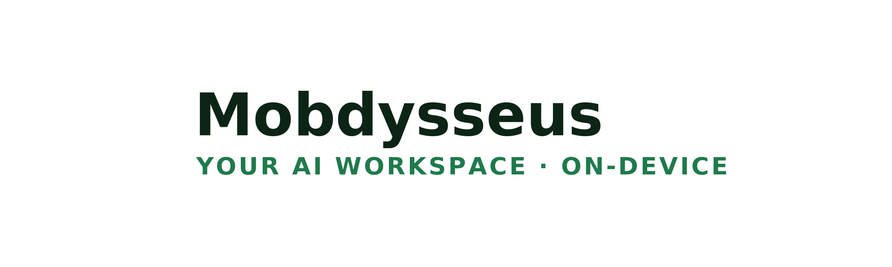
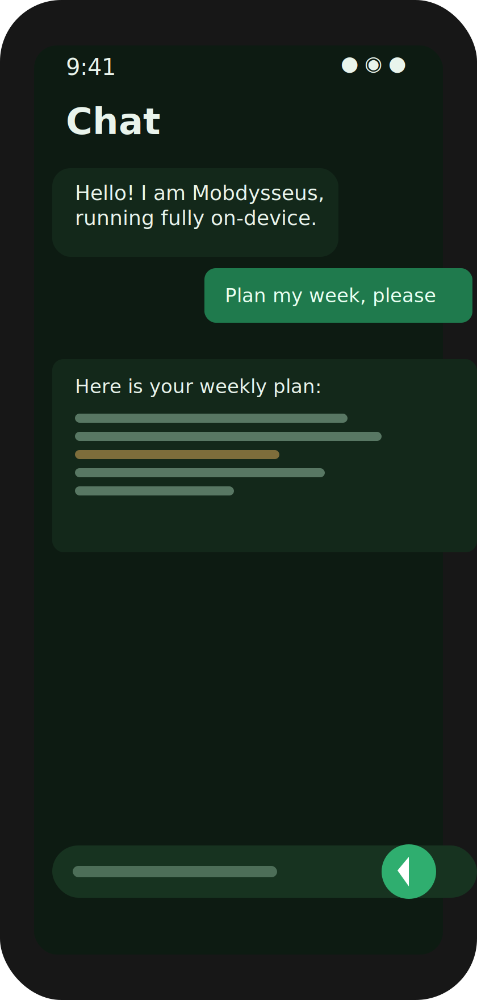
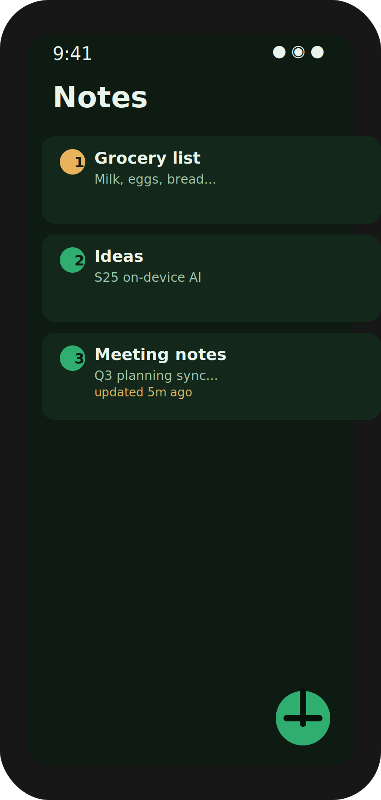
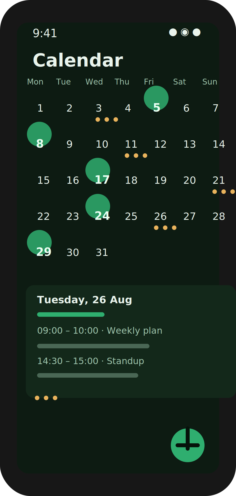
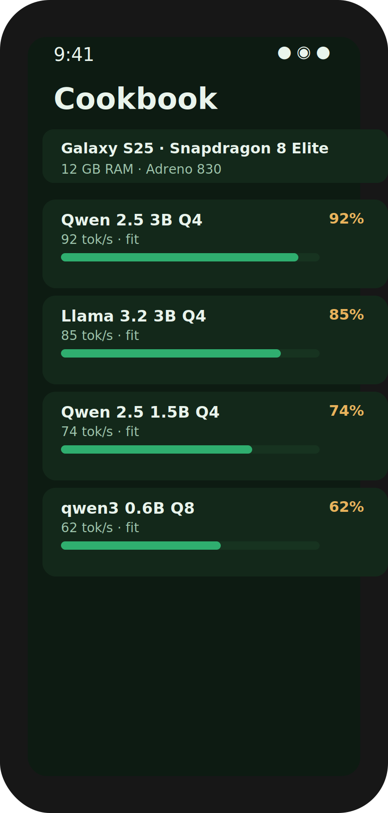
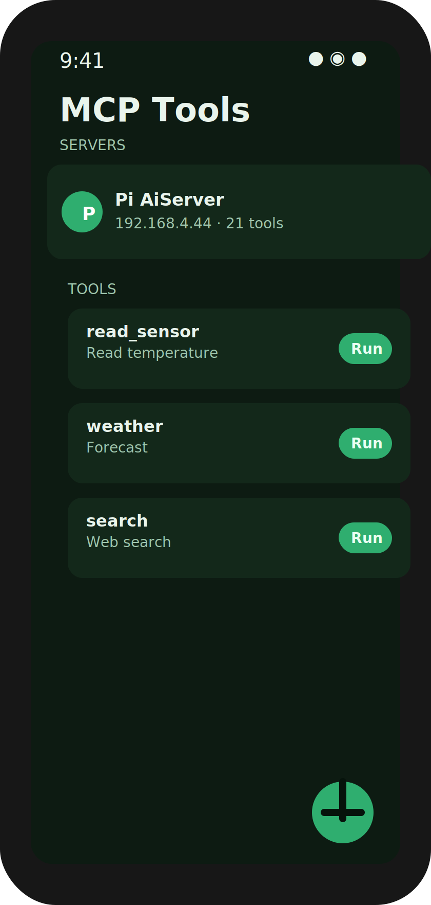
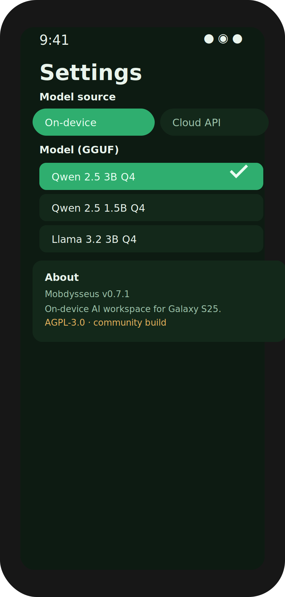

<p align="center">
  
</p>

<p align="center">
  <b>Your AI workspace — on-device.</b><br>
  Notes, tasks, calendar, memory, gallery, research, on-device LLM chat and MCP tools.
  Built and tuned for the <b>Samsung Galaxy S25</b>.
</p>

<p align="center">
  <a href="https://github.com/NaustudentX18/mobdysseus/actions/workflows/ci.yml"></a>
  
  
  
  
</p>

<p align="center"><i>A community rebuild of the <a href="https://github.com/odysseus-dev/odysseus">Odysseus</a> self-hosted AI workspace — not affiliated with the upstream project.</i></p>

---

## Screens

<p align="center">
  
  
  
  
  
  
</p>

**Standalone-first.** No account, no cloud, no telemetry — your data stays on your phone.
Everything works offline out of the box, and you can opt-in to a self-hosted server for a
bigger remote LLM and MCP tools whenever you want.

## Features

| | |
|---|---|
| 💬 **Chat** | Streaming chat over any OpenAI-compatible endpoint *and* a fully on-device GGUF model (llama.cpp via [llmedge](https://github.com/aatricks/llmedge)). Markdown rendering, conversation history, multi-turn context. |
| 📝 **Notes · Tasks · Documents** | Plain offline, JSON-backed stores. Your data is a file, easy to back up. |
| 📅 **Calendar** | Month grid, events, add/edit/delete — completely offline. |
| 🧠 **Memory** | Free-form knowledge entries with full-text search. |
| 🖼️ **Gallery** | Your device photos in a grid with a full-screen viewer. |
| 🔎 **Research** | Web search (DuckDuckGo Instant Answer) rendered as result cards. |
| 🛠️ **Cookbook** | Detects your SoC/RAM and recommends the best on-device model for the S25. |
| 🔌 **MCP Tools** | Add self-hosted [MCP](https://modelcontextprotocol.io) servers, discover tools, invoke them, stream results. |
| ⭐ **Skills** | A marketplace of installable skills (Ask Your Data, Privacy Verdict, One-Tap Capture, Photo OCR, and more on the roadmap). |
| ⚙️ **Settings** | Model source (On-device / Cloud API), provider presets, GGUF picker, connection test, About & licenses. |

## Guides & advice

### Quick start
1. Install `dist/Mobdysseus-*.apk` (side-load — see [Install](#install--signing)).
2. Open the drawer and start with **Chat** or **Notes**. Everything works offline.
3. Want a smarter model? Open **Settings → On-device** and pick a larger GGUF (first message downloads it once, then it's cached).

### On-device model advice (Galaxy S25)
The S25's Snapdragon 8 Elite (12 GB RAM) comfortably runs **3B–4B Q4** models in real time.
Start with **Qwen 2.5 3B Q4** for the best quality/speed balance. For the fastest experience
pick **Qwen 2.5 1.5B Q4**; for maximum quality choose **Llama 3.2 3B Q4**. The **Cookbook**
tab ranks these for your exact device.

### Connect a server (optional)
- **Remote LLM** — Settings → Cloud API → pick a preset (Ollama, DeepSeek, OpenAI, custom) and use **Test connection** to verify.
- **MCP tools** — MCP Tools → **+** → add a server by name + URL (e.g. a self-hosted bridge at `http://192.168.x.x:8101`). Open it to list tools, then **Run** one to stream its output.

### Privacy by design
Your data stays on-device by default. The app touches the network in only three cases, all
explicitly user-initiated: a configured **cloud API provider**, a configured **MCP server**,
and a **model download** from Hugging Face. See [`docs/PRIVACY.md`](docs/PRIVACY.md).

### Battery & background
On-device inference runs inside a **foreground service** with a partial wakelock, so the
model can finish generating without the system killing it, and is `START_STICKY` for
restart resilience on One UI. Long jobs are best run while plugged in.

## Roadmap

Every item targets a **gap the market leaves open** — see [docs/ROADMAP.md](docs/ROADMAP.md) for the full detail and rationale.

| Phase | Theme | Flagship feature | The gap it fills |
|---|---|---|---|
| **0 · Data plane** | On-device retrieval + provable privacy | **Ask Your Data** (RAG over all your notes/docs/photos), **Privacy Verdict** (audit trail), One-Tap Capture, offline OCR | Cloud search can't see local files; "no cloud" is currently unprovable. |
| **1 · Memory plane** | A durable, browsable model of *you* | **Mnemosyne** knowledge graph, Context Docks, Private Inbox, **self-hosted sync (Pi)** | Cloud memory is an opaque black box; local-first tools are desktop-only. |
| **2 · MCP trust & agents** | Safe, agentic on-device tool use | **Phone-as-MCP-server** (consent-gated), permission gate, trust check, agent loops, MCP app store | MCP is desktop/CLI + security-shallow; tool-poisoning is its #1 open problem. |
| **3 · Galaxy S25-native** | Lean into One UI surfaces | **Private voice assistant**, live widgets / Edge panel, DeX panes, health copilot, offline translation | Galaxy AI is cloud-bound + quota-limited; generic AI apps ignore One UI. |

> **North star:** a personal, verifiable, fully offline AI data plane on the Galaxy S25 — with an optional user-owned server tier for power and a trust-first MCP gateway.

## Build from source

Requires JDK 17, the Android SDK (compileSdk 36, minSdk 30), AGP 8.11.1 + Gradle 8.14 (wrapper included).

```bash
./gradlew :app:testDebugUnitTest   # unit tests
./gradlew :app:assembleDebug       # debug APK
./gradlew :app:assembleRelease     # signed release APK
```

Release signing uses `release.keystore` (alias `mobdysseus`); the password is read from
`MOBDYSSEUS_KEYSTORE_PASS` and falls back to `mobdysseus123`.

## Install & signing

Download the latest APK from the **[Releases page](https://github.com/NaustudentX18/mobdysseus/releases)**.

```bash
# verify a release APK
apksigner verify --print-certs Mobdysseus-v0.8.0.apk   # shows CN=Mobdysseus
```

| Version | Download | SHA-256 |
|---|---|---|
| v0.8.0 | [Mobdysseus-v0.8.0.apk](https://github.com/NaustudentX18/mobdysseus/releases/download/v0.8.0/Mobdysseus-v0.8.0.apk) | `3797266f35be037e32702f8b9abe31fce3de7cfbaf084da8d11df7508bc33ed4` |

## Repository layout

```
app/src/main/java/com/mobdysseus/app/
  data/       JSON-backed stores (notes, tasks, docs, calendar, memory, MCP servers)
  ui/         Compose screens (all tabs)
  provider/   remote LLM client (OpenAI-compatible + health check)
  local/      on-device inference (LocalLlmEngine, ModelDownloadManager)
  mcp/        JSON-RPC/SSE MCP client (McpClient, McpTypes)
  service/    foreground inference service
  cookbook/   hardware detection + model ranking
  research/   DuckDuckGo search client
docs/         PLAN, ARCHITECTURE, COOKBOOK_SPEC, SMOKE-TEST, HANDOVER, ATTACK-PLAN, PRIVACY, DEV-GUIDE
scripts/      guard.sh (symlink/temp hygiene), generate_screenshots.py
assets/       brand logo + screenshots
```

## Repo hygiene

- **`scripts/guard.sh`** fails CI if any symlink / temp-overlay leftover appears in source — keeping the tree clean and portable.
- **`docs/DEV-GUIDE.md`** documents the repo conventions for contributors.

## License

**AGPL-3.0-or-later.** This is a community build and is **not affiliated with** the upstream Odysseus project. Third-party attributions are in [`THIRD_PARTY_NOTICES.md`](THIRD_PARTY_NOTICES.md) (llmedge, Compose, ML Kit, and bundled llama.cpp/ggml, whisper.cpp, bark.cpp).

> Built with ❤️ and a great deal of coffee, for the Galaxy S25.
