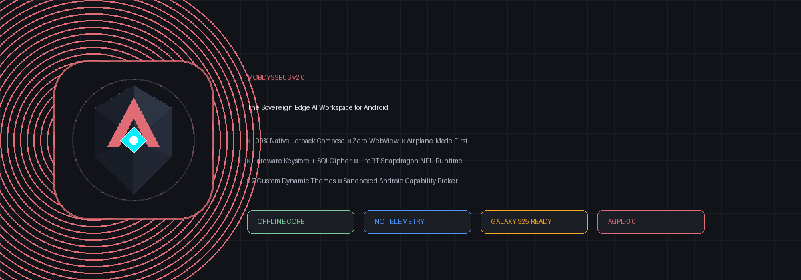
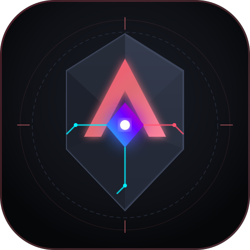
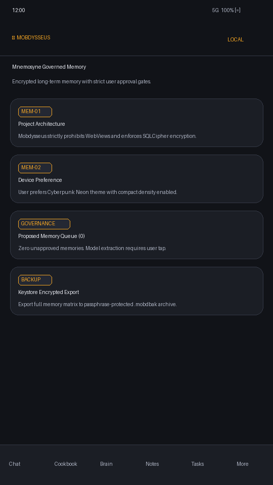
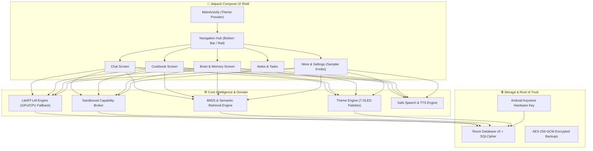

<div align="center">
  

  <br />

  

  # Mobdysseus v2.0
  ### Sovereign On-Device AI Workspace & Edge Intelligence Engine for Android

  [](LICENSE)
  [-green.svg?style=flat-square)](https://developer.android.com)
  [](docs/ARCHITECTURE.md)
  [](docs/ROADMAP.md)
  [](docs/PRIVACY.md)
  [](PARITY.md)
  [](tools/)

  <p align="center">
    <strong>A 100% native, zero-cloud, hardware-accelerated personal AI computing environment.</strong><br />
    No WebViews. No remote server dependencies. Zero tracking. Pure local sovereign intelligence.
  </p>
</div>

---

## 🌟 Visual Showcase

<div align="center">
  <table>
    <tr>
      <td width="50%" align="center">
        <strong>⚡ Local AI Chat & RAG Citations</strong><br />
        
      </td>
      <td width="50%" align="center">
        <strong>🎨 Dynamic 7-Theme Color Engine</strong><br />
        
      </td>
    </tr>
    <tr>
      <td width="50%" align="center">
        <strong>🍲 Cookbook & Parametric Recipes</strong><br />
        
      </td>
      <td width="50%" align="center">
        <strong>🧠 Mnemosyne Governed Memory Matrix</strong><br />
        
      </td>
    </tr>
  </table>
</div>

---

## 🏛️ System Architecture

Mobdysseus is engineered with strict **unidirectional dependency boundaries** (`shell -> navigation -> feature -> core`) and a hardened zero-trust data pipeline:



---

## 🎨 Built-in Theme Showcase

Mobdysseus includes a custom theme engine engineered for OLED efficiency and high-contrast accessibility:

| Theme | Backdrop | Accent | Best Suited For |
|---|---|---|---|
| **Obsidian Coral** *(Default)* | `#111318` | `#E06C75` | Classic dark workspace with warm accents |
| **Cyberpunk Neon** | `#060709` | `#00F0FF` / `#FF007F` | Ultra-vibrant OLED pure black contrast |
| **Midnight Navy** | `#0A0E17` | `#4D96FF` | Soft low-light nighttime reading |
| **Solarized Amber** | `#14120E` | `#F5A623` | Warm espresso palette with gold highlights |
| **Forest Matrix** | `#070F0A` | `#00E676` | Terminal-style hacker green aesthetic |
| **Monokai Vapor** | `#1E1F22` | `#AB87FF` / `#FD971F` | Rich developer syntax aesthetic |
| **Material You** | System | Adaptive | Dynamic wallpaper-extracted palette (Android 12+) |

---

## 🚀 Desktop CutiePie Odysseus Parity Matrix

Mobdysseus achieves full parity across all **59 desktop route modules** (`app.py`), translating desktop primitives into secure Android equivalents:

| Domain | Desktop Paradigm | Mobdysseus v2 Native Equivalent | Parity State |
|---|---|---|---|
| **Chat & History** | FastAPI `/chat` + SQLite | LiteRT-LM on-device token streaming + Room DB | **100% Native** |
| **Cookbook & Recipes** | Python batch runners | Parametric recipe executor + latency profiler | **100% Native** |
| **Brain Memory** | Plaintext markdown memory | Mnemosyne governed memory + user approval gate | **100% Native** |
| **Notes & Tags** | File-based markdown | WYSIWYG/Markdown dual editor + tag taxonomy | **100% Native** |
| **Tasks & Alarms** | Desktop cron scripts | WorkManager recurrence + exact alarm notifications | **100% Native** |
| **Document RAG** | ChromaDB / PyMuPDF | On-device BM25 + LiteRT embeddings + citations | **100% Native** |
| **Tools & MCP** | Subprocess CLI execution | Sandboxed Capability Broker + Approval Sheet | **Sandboxed Replacement** |
| **Calendar/Contacts**| Local CalDAV server | Scoped Android Calendar & Contacts Providers | **Native Replacement** |
| **Provider Vault** | Plaintext config files | Android Keystore encrypted credentials | **100% Native** |
| **Hardware Fit** | CUDA / Torch inspection | Snapdragon 8 Elite NPU & RAM detection matrix | **100% Native** |

*See [docs/PARITY.md](docs/PARITY.md) for the complete 59-route mapping.*

---

## 🗺️ Master Roadmap & Future Horizons

Track our phased development progress across 7 strategic waves:

* [x] **Phase 1: Foundation & Modular Core (v1.0.0)** — Unidirectional architecture, SQLCipher Room, S25 adaptive UI, offline airplane mode.
* [x] **Phase 2: Parity, Theming & Sampler Tuning (v2.0.0)** — 7-theme engine, 59 desktop route parity, sampler tuning suite, visual identity overhaul.
* [ ] **Phase 3: Snapdragon 8 Elite NPU Acceleration (v3.0.0)** — Qualcomm AI Engine Direct (QNN) HTP backend, INT4 quantization, sub-150ms TTFT.
* [ ] **Phase 4: Edge Multimodal Vision & Audio Intelligence (v3.5.0)** — On-device SmolVLM/PaliGemma 2 vision Q&A, Whisper STT, Piper neural TTS.
* [ ] **Phase 5: Dense Vector RAG & Semantic Memory Matrix (v4.0.0)** — SQLite-vec dense vector search, Reciprocal Rank Fusion, Mnemosyne graph memory.
* [ ] **Phase 6: Multi-Agent Swarms & Sandboxed Tool Mesh (v4.5.0)** — GBNF grammar schema enforcement, multi-agent planner/researcher/coder, signed skill packs.
* [ ] **Phase 7: Decentralized Mesh & Multi-Device Ecosystem (v5.0.0+)** — Wi-Fi Aware & Tailscale P2P mesh, Samsung DeX desktop mode, Wear OS companion.

*For the complete granular ticket backlog with checkboxes, see [docs/ROADMAP.md](docs/ROADMAP.md) and [SWARM_BACKLOG.md](SWARM_BACKLOG.md).*

---

## 🛠️ Build, Test & Verification

### Prerequisites
* **JDK 17+**
* **Android SDK (compileSdk 36, minSdk 30)**
* **Python 3.10+ (for contract testing)**

### 1. Run Contract & Boundary Tests (Local Host / CI)
```bash
# Verify 100% dependency boundaries across all Kotlin files
python3 tools/check_dependency_boundaries.py

# Verify desktop capability inventory coverage
python3 tools/validate_desktop_capability_inventory.py

# Run all contract & migration test suites
python3 -m pytest tools/ -v
```

### 2. Authoritative Android Build & Unit Tests (Windows PC / Host)
```bash
# Run unit tests on Android build host
./gradlew testDebugUnitTest

# Assemble signed release APK
./gradlew assembleRelease
```

---

## 🔒 Privacy & Zero-Trust Verification

Mobdysseus is architected around the principle of **computational sovereignty**:
* **Airplane-Mode First:** Turn off Wi-Fi and cellular data — every core workflow continues to operate without degradation.
* **No Unsolicited Sockets:** The app initiates zero background network requests.
* **No Telemetry / No Analytics:** Zero tracking SDKs, zero crash-reporting servers, zero third-party telemetry beacons.
* **Keystore Encrypted Backups:** Full workspace backups are exported as `.mobdbak` containers encrypted via AES-256-GCM with keys derived using PBKDF2.

Read our complete [Privacy Manifesto](docs/PRIVACY.md).

---

## 📜 License & Attributions

Licensed under the **AGPL-3.0-or-later**.  
Third-party notices and attributions are maintained in [THIRD_PARTY_NOTICES.md](THIRD_PARTY_NOTICES.md).

```
Mobdysseus v2.0 — Sovereign Edge AI Workspace for Android
Built with ❤️ for privacy, resilience, and edge intelligence.
```
