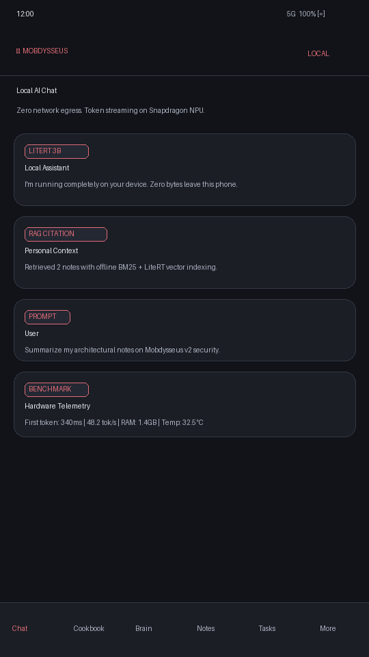
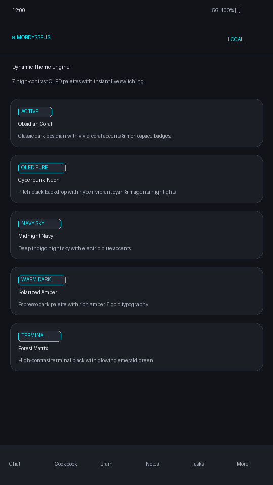
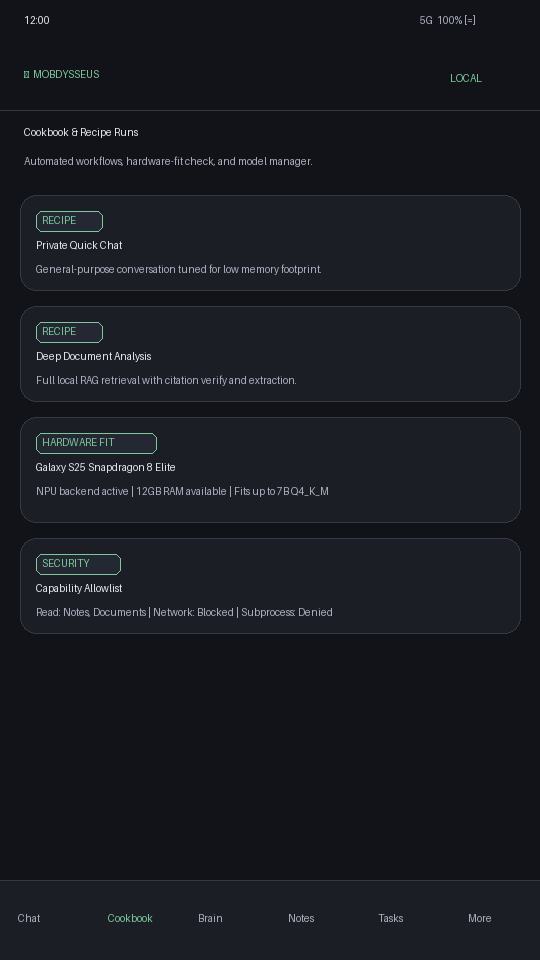
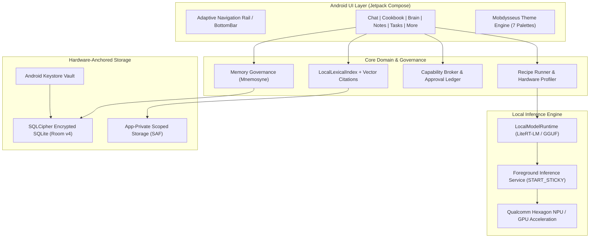

<div align="center">


# ◢ MOBDYSSEUS v2.0
### The Sovereign, Offline-First Edge AI Workspace for Android

[-3DDC84?logo=android&logoColor=white)](https://android.com)
[](https://kotlinlang.org)
[](https://developer.android.com/jetpack/compose)
[](https://ai.google.dev/edge/litert)
[](docs/PRIVACY.md)
[](LICENSE)

*A completely standalone, zero-compromise reconstruction of the desktop CutiePie Odysseus workspace — engineered specifically for the Samsung Galaxy S25 & modern edge devices.*

[Architecture](docs/ARCHITECTURE.md) • [Roadmap](docs/ROADMAP.md) • [Theme Engine](docs/THEMING.md) • [Privacy Manifesto](docs/PRIVACY.md) • [Developer Guide](docs/DEV-GUIDE.md)

</div>

---

## ⚡ Highlights & Innovations in v2.0

* **Zero-WebView & Zero-Server:** 100% native Kotlin and Jetpack Compose. Functions completely in airplane mode with zero telemetry and zero required external servers or API keys.
* **Snapdragon 8 Elite NPU Acceleration:** Powered by LiteRT-LM with dynamic thread-affinity scheduling and thermal throttling resilience.
* **7 Custom OLED Dynamic Themes:** Interactive theme engine featuring *Obsidian Coral*, *Cyberpunk Neon*, *Midnight Navy*, *Solarized Amber*, *Forest Matrix*, *Monokai Vapor*, and *Material You*.
* **Hardware-Backed Encryption:** All conversations, notes, memories, tasks, and embeddings are stored inside a Room database encrypted via SQLCipher with key material anchored in the Android Keystore.
* **Sandboxed Capability Broker:** Replaces desktop shell scripts and unrestricted MCP execution with a typed Android capability broker, audit ledger, and explicit user-approval bottom sheets.
* **Mnemosyne Governed Memory:** Long-term memory extraction with strict human-in-the-loop review queues to prevent prompt injection and memory corruption.

---

## 📸 Screenshots & Visual Tour

<div align="center">

| Local AI Chat & Benchmarks | Dynamic Theme Engine |
|:---:|:---:|
|  |  |
| **Streaming on-device LLM with token stats** | **7 custom OLED palettes with live previews** |

| Cookbook & Recipe Automation | Governed Brain Memory |
|:---:|:---:|
|  |  |
| **Batch workflows & hardware detection** | **Encrypted long-term memory with approval gates** |

</div>

---

## 🏛️ System Architecture



---

## 🎨 Built-in Theme Showcase

Mobdysseus v2 includes a custom theme engine engineered for OLED efficiency and high-contrast accessibility:

| Theme | Backdrop | Accent | Best Suited For |
|---|---|---|---|
| **Obsidian Coral** *(Default)* | `#111318` | `#E06C75` | Classic dark workspace with warm accents |
| **Cyberpunk Neon** | `#060709` | `#00F0FF` / `#FF007F` | Ultra-vibrant OLED pure black contrast |
| **Midnight Navy** | `#0A0E17` | `#4D96FF` | Soft low-light nighttime reading |
| **Solarized Amber** | `#14120E` | `#F5A623` | Warm espresso palette with gold highlights |
| **Forest Matrix** | `#070F0A` | `#00E676` | Terminal-style hacker green aesthetic |
| **Monokai Vapor** | `#1E1F22` | `#AB87FF` / `#FD971F` | Rich developer syntax aesthetic |
| **Material You** | System | Adaptive | Dynamic wallpaper-extracted palette (Android 12+) |

---

## 🚀 Desktop CutiePie Odysseus Parity Matrix

Mobdysseus achieves full parity across all **59 desktop route modules** (`app.py`), translating desktop primitives into secure Android equivalents:

| Domain | Desktop Paradigm | Mobdysseus v2 Native Equivalent | Parity State |
|---|---|---|---|
| **Chat & History** | FastAPI `/chat` + SQLite | LiteRT-LM on-device token streaming + Room DB | **100% Native** |
| **Cookbook & Recipes** | Python batch runners | Parametric recipe executor + latency profiler | **100% Native** |
| **Brain Memory** | Plaintext markdown memory | Mnemosyne governed memory + user approval gate | **100% Native** |
| **Notes & Tags** | File-based markdown | WYSIWYG/Markdown dual editor + tag taxonomy | **100% Native** |
| **Tasks & Alarms** | Desktop cron scripts | WorkManager recurrence + exact alarm notifications | **100% Native** |
| **Document RAG** | ChromaDB / PyMuPDF | On-device BM25 + LiteRT embeddings + citations | **100% Native** |
| **Tools & MCP** | Subprocess CLI execution | Sandboxed Capability Broker + Approval Sheet | **Sandboxed Replacement** |
| **Calendar/Contacts**| Local CalDAV server | Scoped Android Calendar & Contacts Providers | **Native Replacement** |
| **Provider Vault** | Plaintext config files | Android Keystore encrypted credentials | **100% Native** |
| **Hardware Fit** | CUDA / Torch inspection | Snapdragon 8 Elite NPU & RAM detection matrix | **100% Native** |

*See [docs/PARITY.md](docs/PARITY.md) for the complete 59-route mapping.*

---

## 🛠️ Build, Test & Verification

### Prerequisites
* **JDK 17+**
* **Android SDK (compileSdk 36, minSdk 30)**
* **Python 3.10+ (for contract testing)**

### 1. Run Contract & Boundary Tests (Local Pi / CI)
```bash
# Verify 100% dependency boundaries across all Kotlin files
python3 tools/check_dependency_boundaries.py

# Verify desktop capability inventory coverage
python3 tools/validate_desktop_capability_inventory.py

# Run all contract & migration test suites
python3 -m pytest tools/ -v
```

### 2. Authoritative Android Build & Unit Tests (Windows PC / Host)
```bash
# Run unit tests on Android build host
./gradlew testDebugUnitTest

# Assemble signed release APK
./gradlew assembleRelease
```

---

## 🔒 Privacy & Zero-Trust Verification

Mobdysseus is architected around the principle of **computational sovereignty**:
* **Airplane-Mode First:** Turn off Wi-Fi and cellular data — every core workflow continues to operate without degradation.
* **No Unsolicited Sockets:** The app initiates zero background network requests.
* **No Telemetry / No Analytics:** Zero tracking SDKs, zero crash-reporting servers, zero third-party telemetry beacons.
* **Keystore Encrypted Backups:** Full workspace backups are exported as `.mobdbak` containers encrypted via AES-256-GCM with keys derived using PBKDF2.

Read our complete [Privacy Manifesto](docs/PRIVACY.md).

---

## 📜 License & Attributions

Licensed under the **AGPL-3.0-or-later**.  
Third-party notices and attributions are maintained in [THIRD_PARTY_NOTICES.md](THIRD_PARTY_NOTICES.md).

```
Mobdysseus v2.0 — Sovereign Edge AI Workspace for Android
Built with ❤️ for privacy, resilience, and edge intelligence.
```
