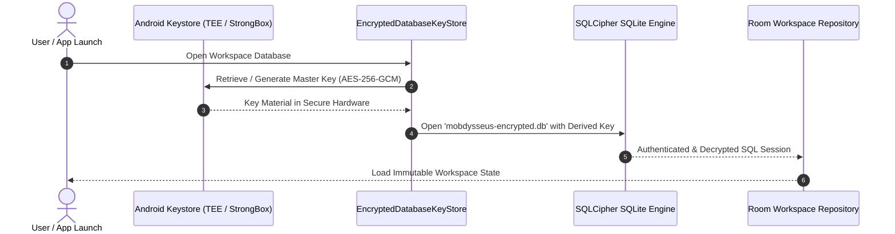

# Mobdysseus v2 — Architecture & Technical Specifications

> **Scope:** Native Android (Kotlin / Jetpack Compose) architecture, security boundaries, offline storage, local inference, and capability sandboxing.

---

## 1. High-Level Architectural Principles

Mobdysseus is built upon four non-negotiable architectural axioms:

1. **Unidirectional Dependency Flow:** The presentation layer (`feature/`) depends on the core domain layer (`core/`), never vice versa. No feature may import another feature's internal implementation directly.
2. **Zero-Trust Storage:** All sensitive data (chats, notes, memories, tasks, credentials) is encrypted at rest using AES-256-GCM via SQLCipher with keys derived and stored inside the hardware Android Keystore.
3. **Deterministic Capability Brokering:** Mobile apps cannot safely execute unrestricted subprocesses or arbitrary TCP/Unix sockets like desktop MCP implementations. All agent actions are dispatched through a typed, permissioned capability broker with user-facing approval diffs.
4. **Resilient Local Inference:** Model inference runs within a foreground Android service (`START_STICKY`) with a partial wakelock to prevent One UI / Android memory killers from terminating long generations.

```
┌─────────────────────────────────────────────────────────────┐
│                      Presentation Layer                     │
│  MainActivity ──> Navigation ──> Feature Screens & Themes   │
└──────────────────────────────┬──────────────────────────────┘
                               │ (Compose State / Actions)
                               ▼
┌─────────────────────────────────────────────────────────────┐
│                      Core Domain Layer                      │
│   • Memory Governance (Mnemosyne)                           │
│   • Local Lexical & Vector RAG (BM25 + LiteRT)             │
│   • Capability Broker & Approval Ledger                     │
│   • Recipe Engine & Hardware Telemetry                      │
└──────────────────────────────┬──────────────────────────────┘
                               │ (Repositories & Services)
                               ▼
┌──────────────────────────────┴──────────────────────────────┐
│                  Platform & Persistence                     │
│   • Room v4 Database + SQLCipher                            │
│   • Android Keystore Vault                                  │
│   • Foreground Inference Service (LiteRT-LM / GGUF)         │
│   • WorkManager Task Scheduler & Scoped Providers           │
└─────────────────────────────────────────────────────────────┘
```

---

## 2. Directory Layout & Module Responsibilities

```
app/src/main/java/com/jakemalby/odysseusmobile/
├── MainActivity.kt                     # Shell wiring, edge-to-edge root, top/bottom bar
├── LocalModelRuntime.kt                # LiteRT / GGUF model loader & token stream bridge
├── SecureWorkspaceStorage.kt           # Keystore-backed JSON fallback storage
│
├── capability/                         # Sandboxed Capability Framework
│   ├── CapabilityPolicy.kt             # Typed capability definitions & permission ledger
│   └── CapabilityAuditPersistence.kt   # Audit log store for all executed actions
│
├── core/                               # Pure Domain Logic (No Android Framework dependencies)
│   ├── Workspace.kt                    # Immutable core data models (Chat, Note, Task, etc.)
│   ├── WorkspaceStore.kt               # Serialization & domain codecs
│   ├── theme/                          # Theme domain & color palettes (7 themes)
│   │   └── ThemeDomain.kt              # AppTheme enum & ThemeColorPalette
│   ├── memory/                         # Long-term memory & extraction gate
│   │   ├── MemoryGovernance.kt         # Extraction review queue & deduplication
│   │   └── MemoryFeatureSupport.kt     # Search & JSON export codecs
│   ├── retrieval/                      # Offline search & RAG
│   │   └── LocalLexicalIndex.kt        # BM25 token index & citation generator
│   ├── task/                           # Task recurrence & alarm contracts
│   │   ├── TaskSchedule.kt             # Cron-like recurrence calculator
│   │   └── TaskReminderScheduler.kt    # Abstract scheduler interface
│   ├── vault/                          # Hardware security & cryptography
│   │   └── AndroidKeystoreVaultCrypto.kt # Keystore AES-GCM cipher provider
│   ├── voice/                          # Offline STT & TTS abstractions
│   │   ├── AndroidVoiceSupport.kt      # SafeTextSpeaker & audio focus manager
│   │   └── VoicePolicy.kt              # Offline recognizer detector
│   └── skills/                         # Declarative signed skills pack engine
│       ├── SkillPackDomain.kt          # Manifest schemas & capability grants
│       └── SkillPackVerifier.kt        # Cryptographic signature & scope verifier
│
├── feature/                            # Compose Screen Implementations
│   ├── ChatScreen.kt                   # Streaming chat, message retry, voice dictation
│   ├── CookbookScreen.kt               # Recipe library, parameter tuning, benchmarks
│   ├── MoreScreen.kt                   # Settings, Theme Selector, Diagnostics, Gallery
│   ├── WorkspaceFeatureScreens.kt      # Brain, Notes (tags/markdown), Tasks (due dates)
│   ├── SafeMarkdownBlocks.kt           # Safe markdown & code block syntax renderer
│   ├── StreamingTextAssembler.kt       # Lock-free token chunk buffer
│   ├── CapabilityPanel.kt              # Approval ledger & permission inspection UI
│   ├── DocumentsPanel.kt               # Document RAG ingestion & citation viewer
│   ├── ProviderPanel.kt                # Keystore provider vault configuration
│   └── DiagnosticsPanel.kt             # Redacted health telemetry exporter
│
├── navigation/                         # Navigation Contracts
│   └── Destination.kt                  # Top-level workspace destinations enum
│
├── persistence/                        # Offline Database & Migrations
│   ├── WorkspacePersistenceDomain.kt   # Storage-neutral snapshot interfaces
│   ├── CoreWorkspaceMapper.kt          # Lossless mapper between Domain and Room records
│   ├── V0WorkspaceMigrationCodec.kt    # Zero-data-loss migration from legacy JSON
│   ├── backup/                         # Encrypted backup & restore
│   │   └── EncryptedBackupCodec.kt     # PBKDF2 + AES-256-GCM backup container
│   └── database/                       # Room & SQLCipher implementation
│       ├── MobdysseusDatabase.kt       # RoomDatabase definition (Schema v4)
│       ├── WorkspaceEntities.kt        # Relational SQLite tables & foreign keys
│       ├── WorkspaceDao.kt             # Reactive queries & atomic transactions
│       ├── RoomWorkspaceRepository.kt  # Repository implementation with cascade deletes
│       └── EncryptedDatabaseKeyStore.kt# Passphrase derivation via Android Keystore
│
└── ui/                                 # Shared UI & Theme Composables
    ├── MobdysseusTheme.kt              # CompositionLocal theme provider & Material 3 scheme
    ├── AdaptiveNavigation.kt           # Responsive bottom-bar / navigation-rail layout
    └── S25Accessibility.kt             # Insets padding, IME keyboard offsets, high-contrast
```

---

## 3. Dependency Boundary Enforcement

All Kotlin source files are continuously validated against strict layer boundaries by `tools/check_dependency_boundaries.py`:

```
Layer Hierarchy Rules:
  Shell (MainActivity) ──> Navigation ──> Feature ──> Core
  Core & Capability    ──> Pure Domain (No imports of Shell, Nav, or Feature)
  Feature X            ──> Core (Never imports Feature Y)
```

If an agent or contributor introduces a circular import or cross-feature leak, the build is failed automatically at the pre-commit gate.

---

## 4. Hardware Security & Cryptography Model



1. **Master Key Generation:** When the database is first initialized, a 256-bit AES master key is generated inside the Android Keystore with `PURPOSE_ENCRYPT | PURPOSE_DECRYPT` and `BLOCK_MODE_GCM`.
2. **SQLCipher PRAGMA Key:** The key material unlocks the SQLCipher SQLite engine via `SupportOpenHelperFactory`. Plaintext SQLite databases are strictly forbidden.
3. **Encrypted Backups:** Backup files (`.mobdbak`) are encrypted using a separate user-provided passphrase with 100,000 rounds of PBKDF2-HMAC-SHA256 and AES-256-GCM authenticated encryption.

---

## 5. Local Inference Engine & Hardware Fit

* **Model Runtime:** Uses Google LiteRT-LM (formerly MediaPipe GenAI) with Qualcomm QNN delegate support for Snapdragon 8 Elite Hexagon NPU.
* **Context Budgeting:** Dynamically budgets KV-cache allocation based on available RAM (e.g. 4096 tokens on 12GB+ RAM devices, 2048 tokens on 8GB devices).
* **Thermal Throttling Resilience:** Listens to `PowerManager.OnThermalStatusChangedListener`. When thermal throttling level exceeds `THERMAL_STATUS_SEVERE`, token generation rate is paced to protect battery health and prevent OS kills.
