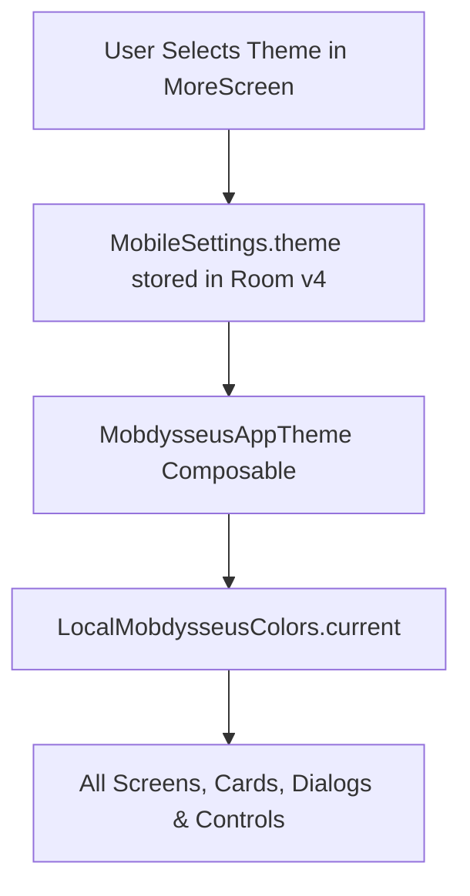

# Mobdysseus Theme Engine & Color Systems

> **Architecture:** Dynamic Compose theme engine with 7 OLED-optimized color palettes and dynamic Material You support.

---

## 🎨 Theme Specifications

All themes in Mobdysseus are engineered for high contrast (WCAG AAA compliance for readability), low OLED power consumption, and distinctive visual aesthetics.



---

### 1. Obsidian Coral *(Default / Signature)*
* **Theme ID:** `OBSIDIAN_CORAL`
* **Vibe:** Classic cyberpunk command center.
* **Palette:**
  * Background: `#111318` (Deep Obsidian)
  * Surface: `#1B1E25` (Dark Slate)
  * Surface Raised: `#242833`
  * Accent / Primary: `#E06C75` (Vibrant Coral)
  * Text Ink: `#E7E9F0`
  * Muted: `#ABB1C0`
  * Border: `#343946`

---

### 2. Cyberpunk Neon
* **Theme ID:** `CYBERPUNK_NEON`
* **Vibe:** Pure OLED black with hyper-vibrant neon glow.
* **Palette:**
  * Background: `#060709` (OLED Pitch Black)
  * Surface: `#0F111A`
  * Surface Raised: `#171A29`
  * Accent / Primary: `#00F0FF` (Electric Cyan)
  * Secondary / Error: `#FF007F` (Neon Magenta)
  * Text Ink: `#E0F7FA`
  * Border: `#1E2640`

---

### 3. Midnight Navy
* **Theme ID:** `MIDNIGHT_NAVY`
* **Vibe:** Deep starry night sky, optimized for nighttime use.
* **Palette:**
  * Background: `#0A0E17` (Deep Indigo)
  * Surface: `#121826`
  * Surface Raised: `#1C2436`
  * Accent / Primary: `#4D96FF` (Electric Blue)
  * Text Ink: `#F0F4FC`
  * Border: `#243049`

---

### 4. Solarized Amber
* **Theme ID:** `SOLARIZED_AMBER`
* **Vibe:** Warm espresso and parchment tones for reduced eye strain.
* **Palette:**
  * Background: `#14120E` (Dark Espresso)
  * Surface: `#1E1B15`
  * Surface Raised: `#2B261E`
  * Accent / Primary: `#F5A623` (Radiant Amber)
  * Text Ink: `#FDF6E3` (Warm Ivory)
  * Border: `#3E362A`

---

### 5. Forest Matrix
* **Theme ID:** `FOREST_MATRIX`
* **Vibe:** High-contrast terminal hacker aesthetic.
* **Palette:**
  * Background: `#070F0A` (Terminal Black)
  * Surface: `#0E1A11`
  * Surface Raised: `#16291C`
  * Accent / Primary: `#00E676` (Emerald Matrix Green)
  * Text Ink: `#E0F2E9`
  * Border: `#1E3B27`

---

### 6. Monokai Vapor
* **Theme ID:** `MONOKAI_VAPOR`
* **Vibe:** Refined code editor palette with violet and orange accents.
* **Palette:**
  * Background: `#1E1F22` (Charcoal)
  * Surface: `#27282D`
  * Surface Raised: `#32343D`
  * Accent / Primary: `#AB87FF` (Soft Violet)
  * Secondary: `#FD971F` (Sunset Orange)
  * Text Ink: `#F8F8F2`
  * Border: `#434552`

---

### 7. Material You *(Dynamic)*
* **Theme ID:** `DYNAMIC_MATERIAL`
* **Vibe:** Android 12+ wallpaper-extracted dynamic palette.
* **Mechanism:** Queries `dynamicDarkColorScheme(context)` at runtime, automatically matching the user's system wallpaper colors while maintaining Mobdysseus contrast standards.

---

## 💻 Developer Usage in Composables

To use theme colors anywhere in Compose without hardcoding hex values:

```kotlin
import com.jakemalby.odysseusmobile.ui.MobdysseusThemeColors

@Composable
fun CustomCard() {
    val colors = MobdysseusThemeColors.current
    
    Surface(
        color = colors.surface,
        shape = RoundedCornerShape(12.dp),
        border = BorderStroke(1.dp, colors.border),
    ) {
        Text(
            text = "Sovereign AI",
            color = colors.primary,
        )
    }
}
```
